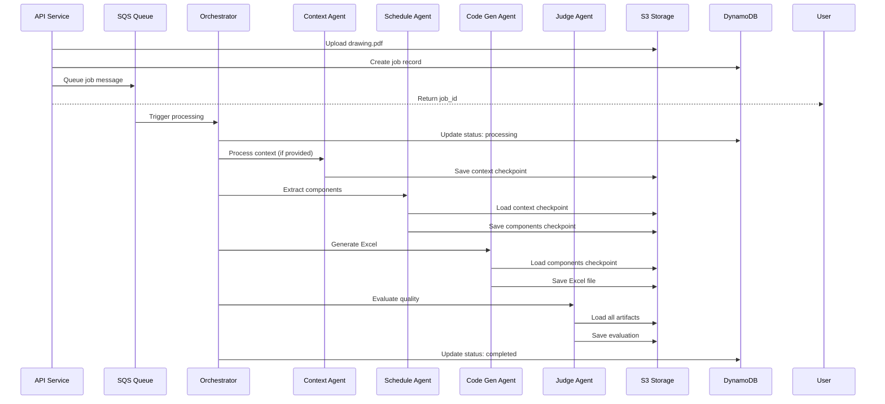
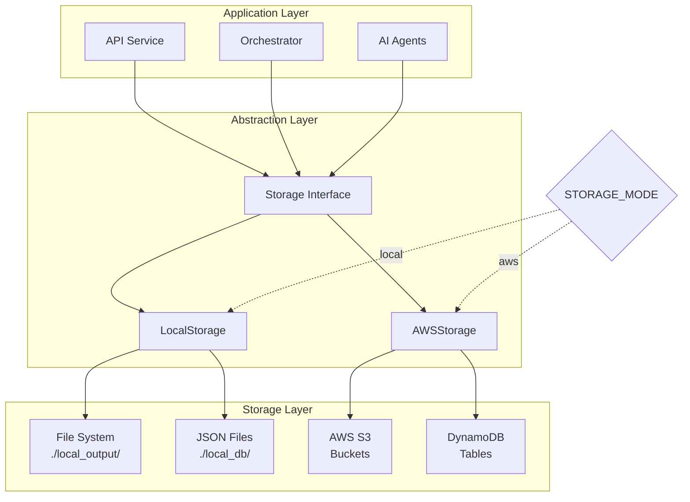

# Components

> ✅ **SDK Migration Complete**: All AI agents have been successfully migrated from Vertex AI SDK to Google GenAI SDK in Story 0.1. See [gemini-sdk-migration-plan.md](./gemini-sdk-migration-plan.md) for details.

## API Service

**Responsibility:** REST API endpoint for drawing upload and job management

**Key Interfaces:**
- POST /process-drawing - Accept PDF and optional context, return job ID
- GET /status/{job_id} - Return current job status and results
- GET /download/{job_id}/{file_type} - Stream result files to user

**Dependencies:** AWS API Gateway, Lambda runtime, S3 client, DynamoDB client

**Technology Stack:** Python 3.11, FastAPI, AWS Lambda, boto3

## Processing Orchestrator

**Responsibility:** Coordinate the multi-agent pipeline and manage checkpoints

**Key Interfaces:**
- process_job(job_id) - Main orchestration entry point
- save_checkpoint(job_id, stage, data) - Persist intermediate state
- load_checkpoint(job_id, stage) - Retrieve for recovery/modification

**Dependencies:** All AI agents, Storage abstraction layer, Job status manager

**Technology Stack:** Python 3.11, AWS Lambda (single function), asyncio for coordination

## Context Agent

**Responsibility:** Process optional context documents into AI-friendly structured format

**Key Interfaces:**
- extract_context(file_path) - Process DOCX/PDF/text into structured JSON
- summarize_specifications(raw_text) - Extract lock types and requirements

**Dependencies:** Gemini 2.5 Flash API, Document parsers (python-docx, pypdf)

**Technology Stack:** Python 3.11, Google GenAI SDK (0.2.0), cost-optimized for Flash model

## Schedule Agent  

**Responsibility:** Analyze security drawings and extract access control components

**Key Interfaces:**
- extract_components(drawing_path, context=None) - Main extraction logic
- identify_relevant_pages(pdf_pages) - Filter security vs non-security pages
- build_component_relationships(components) - Associate readers/buttons with doors

**Dependencies:** Gemini 2.5 Pro API, PDF processing libraries, Context checkpoint

**Technology Stack:** Python 3.11, Google GenAI SDK (0.2.0), native PDF support via File API

## Excel Generation Agent (formerly Code Generation Agent)

**Responsibility:** Transform component JSON into formatted Excel schedules using Gemini code execution

**Key Interfaces:**
- generate_excel(components_json) -> str - Generate Excel using Gemini code execution, returns base64
- _build_excel_prompt(components) -> str - Build prompt for Gemini to generate Excel code
- _extract_excel_from_response(response) -> str - Extract base64 Excel data from execution results

**Dependencies:** Gemini 2.5 Flash with code execution enabled, Components checkpoint

**Technology Stack:** Python 3.11, Google GenAI SDK with ToolCodeExecution, openpyxl (in Gemini environment)

**Implementation Notes:**
- Uses `gemini-2.5-flash` model (not Pro) for cost efficiency
- Enables code execution via `types.Tool(code_execution=types.ToolCodeExecution())`
- Excel generated in Gemini's sandboxed environment with openpyxl
- Returns base64-encoded Excel file from code execution output
- 30-second execution timeout (Gemini limit)

## Judge Agent

**Responsibility:** Evaluate extraction quality and provide actionable feedback

**Key Interfaces:**
- evaluate_extraction(drawing, components, excel) - Semantic quality assessment
- generate_report(evaluation) - Structure feedback for users

**Dependencies:** Gemini 2.5 Pro API, Access to original drawing and outputs

**Technology Stack:** Python 3.11, Google GenAI SDK (0.2.0), structured evaluation prompts

## Storage Abstraction Layer

**Responsibility:** Unified interface for file operations across local/AWS environments

**Location:** `src/utils/storage_manager.py`

**Key Interfaces:**
```python
class StorageInterface(ABC):
    async def save_file(self, path: str, content: bytes) -> str
    async def get_file(self, path: str) -> bytes  
    async def generate_download_url(self, path: str) -> str
    async def save_job_status(self, job_id: str, status: dict) -> None
```

**Implementations:**
- LocalStorage - File system operations for local development
- S3Storage - AWS S3 operations for production

**Dependencies:** AWS S3, DynamoDB, Local filesystem

**Technology Stack:** Python 3.11, boto3, abstract base classes, environment detection

**Implementation Notes:**
- Automatically selects storage backend based on STORAGE_MODE environment variable
- Handles base64 decoding for Excel files from Gemini
- Provides consistent interface regardless of storage backend

## Component Diagrams

### Processing Pipeline Sequence



### Storage Abstraction Pattern



## Pipeline Configuration System

**Purpose:** Enable flexible processing paths based on input data and user preferences

**Pipeline Routes:**
```python
PIPELINE_CONFIGS = {
    # Standard pipelines
    "full_analysis": ["context", "schedule", "excel_generation", "judge"],
    "no_context": ["schedule", "excel_generation", "judge"],
    
    # Single agent operations (future dashboard/API features)
    "extract_only": ["schedule"],  # Just extract components to JSON
    "excel_from_json": ["excel_generation"],  # Generate Excel from existing JSON
    "evaluate_schedule": ["judge"],  # Evaluate existing schedule
    "parse_context": ["context"],  # Process context document only
    
    # Specialized workflows (future)
    "quick_validation": ["schedule", "judge"],  # Skip Excel generation
    "door_count_only": ["schedule", "summarizer"],
    "revision_compare": ["schedule", "diff_analyzer", "report"],
    "lock_schedule": ["schedule", "lock_filter", "excel_generation"]
}
```

**Pipeline Selection Logic:**
```python
def select_pipeline(job_data, user_preferences=None):
    # Default logic for Phase 1
    if not job_data.get('context_file_key'):
        return PIPELINE_CONFIGS['no_context']
    
    # Future: User-selected pipeline
    if user_preferences and user_preferences.get('pipeline'):
        return PIPELINE_CONFIGS[user_preferences['pipeline']]
    
    return PIPELINE_CONFIGS['full_analysis']
```

**Future Dashboard Integration:**
- Users can select processing modes
- Custom pipeline builder for advanced users
- Cost/time estimates per pipeline
- API endpoints for each pipeline type
