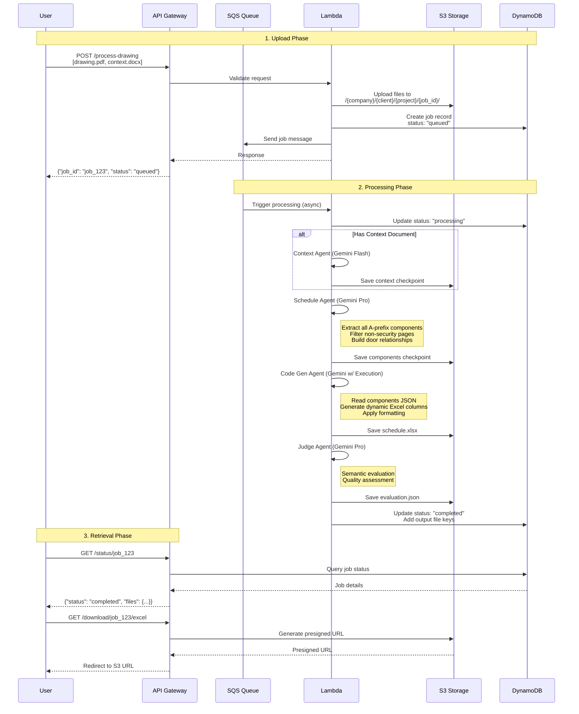
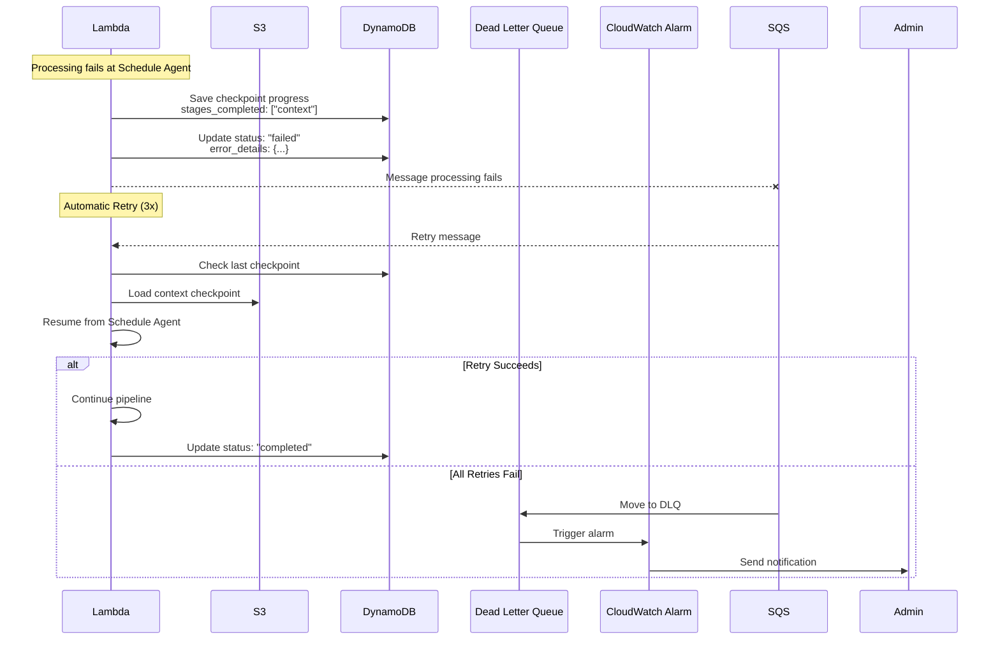
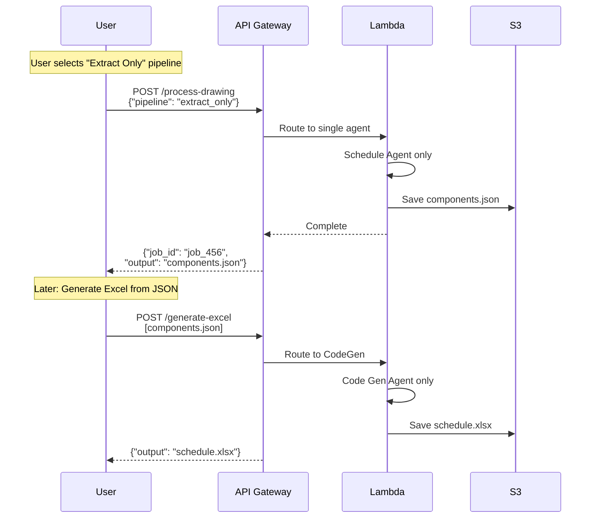

# Core Workflows

## Standard Drawing Processing Workflow

```mermaid
sequenceDiagram
    participant U as User
    participant API as API Gateway
    participant Q as SQS Queue
    participant L as Lambda
    participant S3 as S3 Storage
    participant DB as DynamoDB
    
    Note over U,DB: 1. Upload Phase
    U->>API: POST /process-drawing<br/>[drawing.pdf, context.docx]
    API->>L: Validate request
    L->>S3: Upload files to<br/>/{company}/{client}/{project}/{job_id}/
    L->>DB: Create job record<br/>status: "queued"
    L->>Q: Send job message
    L-->>API: Response
    API-->>U: {"job_id": "job_123", "status": "queued"}
    
    Note over Q,DB: 2. Processing Phase
    Q->>L: Trigger processing (async)
    L->>DB: Update status: "processing"
    
    alt Has Context Document
        L->>L: Context Agent (Gemini Flash)
        L->>S3: Save context checkpoint
    end
    
    L->>L: Schedule Agent (Gemini Pro)
    Note right of L: Extract all A-prefix components<br/>Filter non-security pages<br/>Build door relationships
    L->>S3: Save components checkpoint
    
    L->>L: Code Gen Agent (Gemini w/ Execution)
    Note right of L: Read components JSON<br/>Generate dynamic Excel columns<br/>Apply formatting
    L->>S3: Save schedule.xlsx
    
    L->>L: Judge Agent (Gemini Pro)
    Note right of L: Semantic evaluation<br/>Quality assessment
    L->>S3: Save evaluation.json
    
    L->>DB: Update status: "completed"<br/>Add output file keys
    
    Note over U,API: 3. Retrieval Phase
    U->>API: GET /status/job_123
    API->>DB: Query job status
    DB-->>API: Job details
    API-->>U: {"status": "completed", "files": {...}}
    
    U->>API: GET /download/job_123/excel
    API->>S3: Generate presigned URL
    S3-->>API: Presigned URL
    API-->>U: Redirect to S3 URL
```

## Error Recovery Workflow

```mermaid
sequenceDiagram
    participant L as Lambda
    participant S3 as S3
    participant DB as DynamoDB
    participant DLQ as Dead Letter Queue
    participant Alert as CloudWatch Alarm
    
    Note over L: Processing fails at Schedule Agent
    L->>DB: Save checkpoint progress<br/>stages_completed: ["context"]
    L->>DB: Update status: "failed"<br/>error_details: {...}
    L--xSQS: Message processing fails
    
    Note over L: Automatic Retry (3x)
    SQS-->>L: Retry message
    L->>DB: Check last checkpoint
    L->>S3: Load context checkpoint
    L->>L: Resume from Schedule Agent
    
    alt Retry Succeeds
        L->>L: Continue pipeline
        L->>DB: Update status: "completed"
    else All Retries Fail
        SQS->>DLQ: Move to DLQ
        DLQ->>Alert: Trigger alarm
        Alert->>Admin: Send notification
    end
```

## Future: Single Agent Workflow

```mermaid
sequenceDiagram
    participant U as User
    participant API as API Gateway
    participant L as Lambda
    participant S3 as S3
    
    Note over U: User selects "Extract Only" pipeline
    U->>API: POST /process-drawing<br/>{"pipeline": "extract_only"}
    API->>L: Route to single agent
    
    L->>L: Schedule Agent only
    L->>S3: Save components.json
    L-->>API: Complete
    API-->>U: {"job_id": "job_456",<br/>"output": "components.json"}
    
    Note over U: Later: Generate Excel from JSON
    U->>API: POST /generate-excel<br/>[components.json]
    API->>L: Route to CodeGen
    L->>L: Code Gen Agent only
    L->>S3: Save schedule.xlsx
    API-->>U: {"output": "schedule.xlsx"}
```
