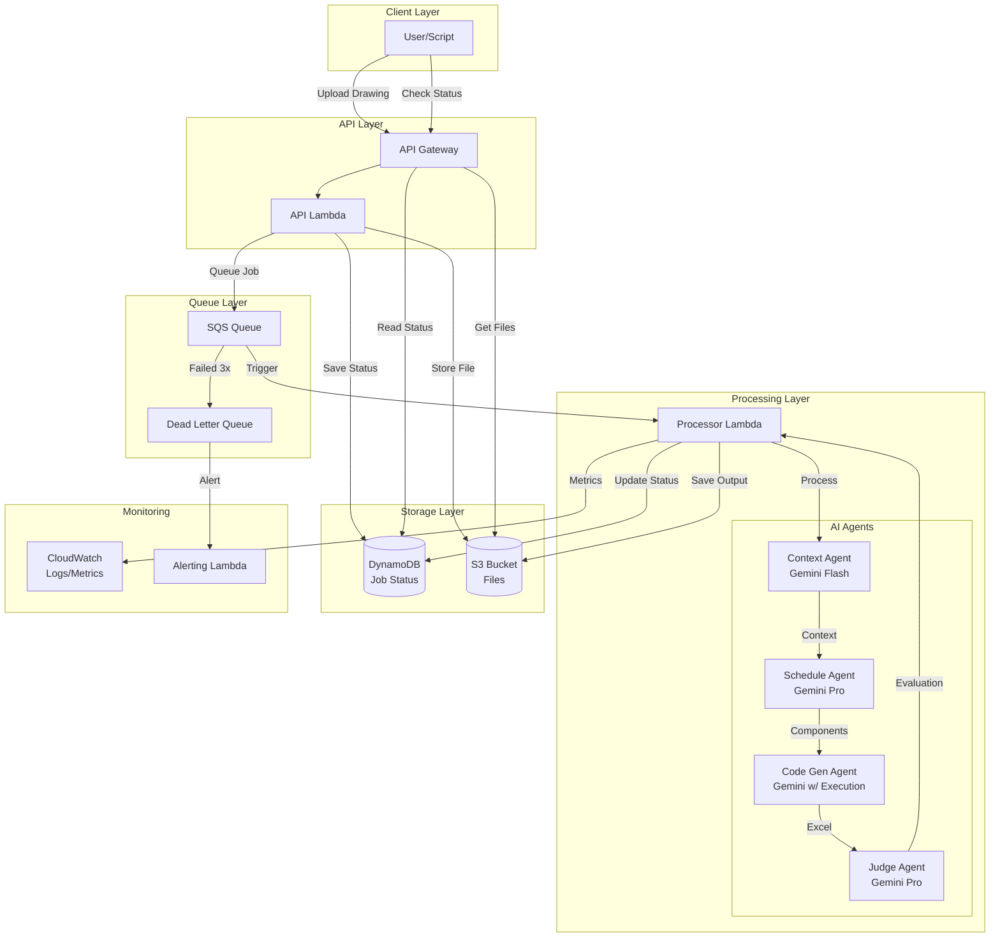

# High Level Architecture

## Technical Summary

The Security Design Assistant is a serverless, event-driven system built on AWS Lambda that processes security drawings through a multi-agent AI pipeline. The architecture leverages asynchronous queue-based processing to handle long-running AI analysis tasks, with Gemini-powered agents specializing in context understanding, drawing analysis, and Excel generation. The system prioritizes accuracy over speed, using semantic evaluation to ensure reliable extraction of access control components from complex technical drawings.

## High Level Overview

**Architectural Style**: Serverless Event-Driven Architecture with Multi-Agent AI Pipeline

**Repository Structure**: Monorepo containing all services, agents, utilities, and infrastructure code

**Service Architecture**: Queue-Based Asynchronous Processing
- REST API Gateway accepts drawing uploads and returns job IDs immediately
- SQS queues decouple API from processing, enabling automatic scaling
- Lambda functions process jobs through specialized AI agents
- DynamoDB tracks job status and metadata
- S3 stores input drawings and generated Excel outputs

**Primary Data Flow**:
1. User uploads PDF drawing with optional context documents
2. API validates request and queues job
3. Processing pipeline extracts components using AI agents
4. System generates Excel schedule and evaluation report
5. User retrieves results via status endpoint

**Key Architectural Decisions**:
- **Serverless-First**: Eliminates infrastructure management, scales to zero, pay-per-use
- **Queue-Based**: Handles long AI processing times beyond API timeout limits
- **Multi-Agent Design**: Separates concerns between context, analysis, and generation
- **Semantic Evaluation**: AI judge provides quality assessment rather than numeric accuracy
- **Modular AI Interface**: Abstracts provider-specific features for future flexibility

## High Level Project Diagram

## Architectural and Design Patterns

- **Serverless Architecture:** AWS Lambda for all compute, eliminating server management - _Rationale:_ Aligns with PRD requirement for cost optimization and automatic scaling, perfect for variable workload
- **Event-Driven Processing:** SQS message-driven pipeline with Lambda triggers - _Rationale:_ Handles long-running AI tasks beyond API timeouts, provides natural retry mechanism
- **Multi-Agent Pattern:** Specialized AI agents with single responsibilities - _Rationale:_ Enables independent optimization of each stage, easier testing, and clear token budget management
- **Repository Pattern:** Abstract S3 and DynamoDB access behind interfaces - _Rationale:_ Enables local development with file system, simplifies testing, future database flexibility
- **Circuit Breaker Pattern:** For Gemini API calls with exponential backoff - _Rationale:_ Handles rate limits gracefully, prevents cascade failures, manages API costs
- **Checkpoint Pattern:** Save progress between agent stages to DynamoDB - _Rationale:_ Enables recovery from Lambda timeouts, provides detailed progress tracking
- **Semantic Evaluation Pattern:** AI judge assesses quality vs numeric thresholds - _Rationale:_ Aligns with drawing complexity where "accuracy" is contextual, provides actionable feedback

## Implementation Refinements

**Single Lambda Architecture:** All agents implemented as functions within a single Lambda to minimize cold starts and orchestration overhead. Self-invocation between stages maintains separation of concerns while simplifying deployment.

**Checkpoint Strategy:** Rich checkpoints saved between each agent stage enable:
- Recovery from Lambda timeouts without full reprocessing
- Future modification workflows without re-analyzing drawings
- Detailed progress tracking and debugging
- Version history for iterative refinements

**Streaming Strategy:**
- **Stream:** API responses to users, large file uploads to S3 (>25MB)
- **Load Fully:** PDF processing (pypdf/pdf2image requirements), JSON data (<1MB), Gemini inputs
- **Decision Rule:** Stream when passing through, load when processing

**Phase 1 Simplifications:**
- Sequential page processing (parallel in future phase)
- 3GB Lambda memory (optimal price/performance)
- Basic retry via SQS (no Step Functions)
- Polling for status (no webhooks)
- Re-run for corrections (modification agent in Phase 2)

## Testing Strategy

**Three-Tier Testing Approach:**

1. **Unit Tests (Mock-Based)**
   - Purpose: Test code logic, error handling, data transformations
   - Cost: FREE - uses mocked API responses via unittest.mock
   - Frequency: Every commit, PR, local development
   - Location: `tests/unit/`

2. **Integration Tests (Mock-Based)**
   - Purpose: Test pipeline flow, checkpoints, component interactions
   - Cost: FREE - uses mocked API responses
   - Frequency: Every PR, before deployment
   - Location: `tests/integration/`

3. **Evaluation Tests (Real API Calls)**
   - Purpose: Measure actual AI accuracy, consistency, performance
   - Cost: $0.50-$2.00 per run (real Gemini API calls)
   - Frequency: After prompt changes, weekly performance checks
   - Location: `tests/evaluation/`
   - Execution: Requires `RUN_EVAL_TESTS=true` environment variable

**Mock Implementation:**
- Uses unittest.mock for all Gemini API interactions
- Predictable, deterministic test responses
- Enables fast, free testing of AI-dependent code
- Mock responses updated when API interface changes

**Critical Testing Rule:** Evaluation tests are the ONLY way to measure true AI performance. Unit/integration tests verify code correctness, not AI accuracy.
